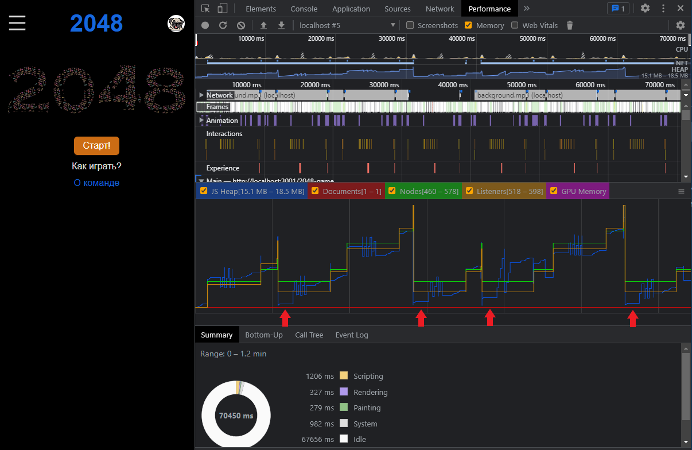

# Проверка утечки памяти

Для оценки утечки памяти в течение минуты 6 раз запускается игра, и игровой процесс длится несколько секунд.   
Периодически видна работа сборщика мусора: по окончании игрового процесса размер занятой памяти падает.
Характерные места отмечены стрелками.   
Минимальное значение при этом не растет.    
Все говорит об отсутствии утечки памяти.
